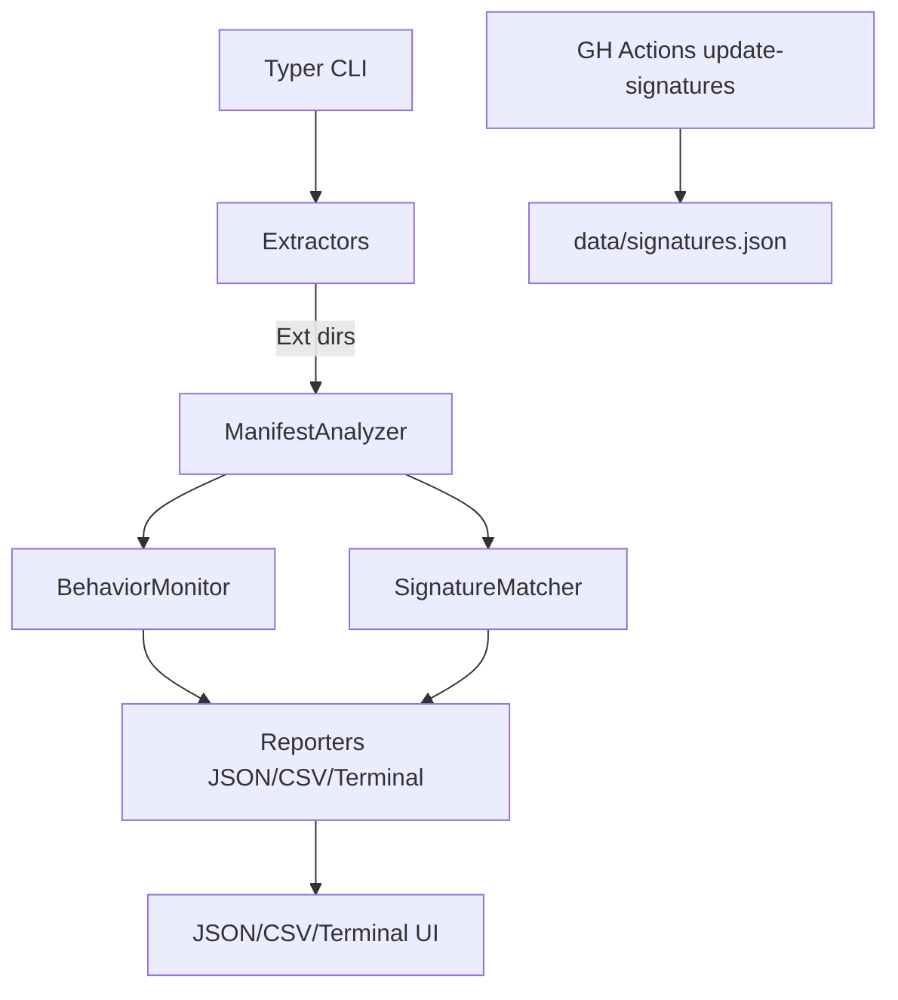

# ChromeGuard

[](#)
[](#)
[](#license)
[](#)
 
Herramienta open-source de línea de comandos para auditar, monitorear y detectar extensiones maliciosas de Chrome/Edge/Brave. Diseñada tras incidentes recientes (OX Security, Koi Security) donde extensiones “Featured” exfiltraron chats de IA.

> Disclaimer: For educational and defensive purposes only. Úsalo bajo tu propia responsabilidad y siempre con consentimiento del usuario/organización.

## Quick Start

```bash
python -m venv .venv && source .venv/bin/activate
pip install --upgrade pip
pip install -e .
chromeguard scan --browser chrome --output report.json
```

## Features
- Auditoría de `manifest.json` con scoring de riesgo (permisos, CSP, WER).
- Detección de firmas maliciosas (regex y reglas YAML).
- Monitoreo de comportamiento con Playwright (network + DOM scraping).
- Reportes en JSON/CSV y output colorizado con Rich.
- Actualizaciones automáticas de la base de firmas vía GitHub Actions.
- Compatible macOS (Apple Silicon), Linux, Windows/WSL.

### Ejemplo visual (asciinema)
[Demo CLI](https://asciinema.org/a/demo-placeholder)

## CLI principal

```bash
chromeguard scan --browser chrome --output report.json
chromeguard watch --browser edge --interval 60
chromeguard check <extension_id>
chromeguard update
chromeguard whitelist add <extension_id>
```

## Arquitectura (mermaid)



## Cómo contribuir
1. Fork + branch por feature.
2. Añade firmas en `data/signatures.json` y permisos en `data/dangerous_permissions.yaml`.
3. Ejecuta `pytest --cov=chromeguard`.
4. Abre PR con checklist de seguridad cumplido.

## Roadmap
- Soporte Firefox y manifest v2 heredado.
- Dashboards FastAPI/React para equipos SOC.
- Integración con Slack/Discord webhooks.
- Modo telemetry opt-in para estadísticas anónimas.
- Paquetes Homebrew/Chocolatey.

## Instalación detallada
Consulta `docs/INSTALLATION.md` (pyenv, Poety/Hatch, Windows WSL).

## Créditos
- Incidentes publicados por OX Security y Koi Security motivaron la creación del proyecto.
- Comunidad de investigadores de extensiones maliciosas.

## Licencia
MIT. Ver `LICENSE`.

